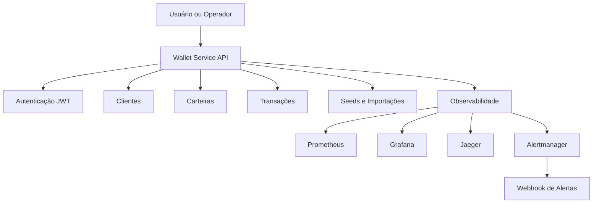

# Wallet Service API

API REST para gestão de clientes, carteiras, autenticação, transações financeiras e operação assistida por observabilidade.

## 🎯 Visão Geral

O Wallet Service API centraliza o ciclo principal de uma carteira digital:

- autenticação e autorização com JWT
- gestão de clientes e carteiras
- operações de depósito, saque e transferência
- carga inicial de dados para apoio a ambientes locais
- documentação interativa com Swagger/OpenAPI
- monitoramento com métricas, tracing, dashboards e alertas
- execução local e containerizada

## 🗺️ Visão funcional da aplicação



## 📋 Requisitos

- Java 21
- Maven 3.9+
- Docker / Docker Compose
- Git
- PostgreSQL para execução local fora do compose

## 🚀 Como começar

### Clonar o repositório

```bash
git clone https://github.com/gustavo1282/wallet-service-api.git
cd wallet-service-api
```

### Build local

```bash
./mvnw clean verify
```

### Subir a aplicação localmente

```bash
./mvnw spring-boot:run -Dspring-boot.run.arguments="--spring.profiles.active=local"
```

### Subir o ambiente com Docker

```bash
docker-compose up -d
```

## 🌐 Acessos locais

### Aplicação
- **Contexto base:** `http://localhost:8080/wallet-service-api`
- **Base da API:** `http://localhost:8080/wallet-service-api/api/v1`
- **Swagger UI:** `http://localhost:8080/wallet-service-api/swagger-ui.html`
- **OpenAPI:** `http://localhost:8080/wallet-service-api/v3/api-docs`
- **Health:** `http://localhost:8080/wallet-service-api/actuator/health`
- **Prometheus da aplicação:** `http://localhost:8080/wallet-service-api/actuator/prometheus`

### Observabilidade
- **Prometheus:** `http://localhost:9090`
- **Grafana:** `http://localhost:3000`
- **Jaeger:** `http://localhost:16686`
- **Alertmanager:** `http://localhost:9093`

### Apoio operacional
- **Vault:** `http://localhost:8200`
- **PgAdmin:** `http://localhost:5050`

## 🏗️ Estrutura do projeto

```text
wallet-service-api/
├── src/
│   ├── main/
│   │   ├── java/com/guga/walletserviceapi/
│   │   │   ├── config/
│   │   │   ├── controller/
│   │   │   ├── dto/
│   │   │   ├── model/
│   │   │   ├── repository/
│   │   │   ├── security/
│   │   │   └── service/
│   │   └── resources/
├── data/
│   ├── docs/
│   ├── postman/
│   ├── scripts/
│   └── seed/
├── prometheus/
├── alertmanager/
├── grafana/
├── docker-compose.yml
└── pom.xml
```

## 🔐 Autenticação

A autenticação usa JWT Bearer Token.

### Fluxo principal

1. realizar login em `POST /api/v1/auth/login`
2. receber `accessToken` e `refreshToken`
3. enviar `Authorization: Bearer {accessToken}` nas rotas protegidas
4. renovar o token quando necessário em `POST /api/v1/auth/refresh`

### Rotas de autenticação

| Método | Endpoint | Objetivo |
|---|---|---|
| POST | `/api/v1/auth/login` | autenticar usuário |
| GET | `/api/v1/auth/my_profile` | consultar contexto autenticado |
| POST | `/api/v1/auth/refresh` | renovar access token |
| POST | `/api/v1/auth/register` | cadastrar novo login |
| POST | `/api/v1/auth/test/anylogin` | apoio a cenários de teste |

## 📚 Documentação técnica

- [API_REFERENCE.md](data/docs/API_REFERENCE.md)
- [ARCHITECTURE_AND_DESIGN.md](data/docs/ARCHITECTURE_AND_DESIGN.md)
- [CONTRIBUTING.md](data/docs/CONTRIBUTING.md)
- [DATA_MODEL.md](data/docs/DATA_MODEL.md)
- [OBSERVABILITY.md](data/docs/OBSERVABILITY.md)
- [SECURITY.md](data/docs/SECURITY.md)

## 🧪 Testes e qualidade

### Testes locais

```bash
./mvnw test
```

### Cobertura

```bash
./mvnw test jacoco:report
```

### Validação completa

```bash
./mvnw clean verify
```

### Script de qualidade

```bash
bash data/scripts/quality/wallet_quality.sh
```

## 🐳 Operação com Docker e scripts

### Compose

```bash
docker-compose up -d
docker-compose stop
docker-compose down
```

### Script principal do projeto

```bash
./data/scripts/docker/wallet.sh up all
```

### Limpeza completa do ambiente Docker

```bash
bash data/scripts/docker/prepare-docker.sh
```

## 📈 Observabilidade e alertas

O ambiente inclui monitoramento e operação com:

- Prometheus para coleta de métricas
- Grafana para dashboards
- Jaeger para tracing
- Alertmanager para roteamento de alertas
- webhook da aplicação para recebimento de notificações operacionais

## 📌 Observações

- a documentação funcional oficial deve ser consultada no Swagger e nos arquivos em `data/docs/`
- os fluxos operacionais de Docker, qualidade, Grafana e Newman devem permanecer alinhados com os scripts versionados no repositório
