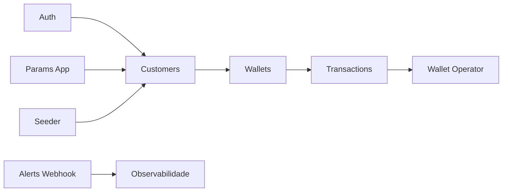

# API Reference

Guia funcional dos endpoints expostos pelo Wallet Service API.

## 📋 Sumário

- [Autenticação](#autenticação)
- [Clientes](#clientes)
- [Carteiras](#carteiras)
- [Transações](#transações)
- [Operações auxiliares](#operações-auxiliares)
- [Parâmetros](#parâmetros)
- [Observabilidade e alertas](#observabilidade-e-alertas)

## 🗺️ Mapa de recursos



## Autenticação

A autenticação é feita por JWT Bearer Token.

### Endpoints principais

| Método | Endpoint | Objetivo |
|---|---|---|
| POST | `/api/v1/auth/login` | autenticar usuário |
| GET | `/api/v1/auth/my_profile` | consultar contexto autenticado |
| POST | `/api/v1/auth/refresh` | renovar access token |
| POST | `/api/v1/auth/register` | cadastrar novo login |
| POST | `/api/v1/auth/test/anylogin` | apoiar cenários controlados de teste |

### Cabeçalho esperado

```http
Authorization: Bearer {accessToken}
```

## Clientes

Os recursos de cliente estão organizados para dois contextos: administração e uso autenticado.

### Contexto autenticado

| Método | Endpoint | Objetivo |
|---|---|---|
| GET | `/api/v1/customers/me` | consultar o próprio cadastro |
| PUT | `/api/v1/customers/me` | atualizar o próprio cadastro |

### Contexto administrativo

| Método | Endpoint | Objetivo |
|---|---|---|
| GET | `/api/v1/customers` | listar clientes |
| POST | `/api/v1/customers` | criar cliente |
| GET | `/api/v1/customers/{id}` | buscar cliente por identificador |
| PUT | `/api/v1/customers/{id}` | atualizar cliente |

## Carteiras

As carteiras seguem a mesma separação entre contexto autenticado e administração.

### Contexto autenticado

| Método | Endpoint | Objetivo |
|---|---|---|
| GET | `/api/v1/wallets/me` | consultar a carteira principal do usuário |
| GET | `/api/v1/wallets/me/list` | listar carteiras vinculadas ao usuário |
| PUT | `/api/v1/wallets/me` | atualizar dados permitidos da carteira do usuário |

### Contexto administrativo

| Método | Endpoint | Objetivo |
|---|---|---|
| GET | `/api/v1/wallets` | listar carteiras |
| POST | `/api/v1/wallets` | criar carteira |
| GET | `/api/v1/wallets/{id}` | buscar carteira por identificador |
| PUT | `/api/v1/wallets/{id}` | atualizar carteira |
| GET | `/api/v1/wallets/customer/{id}` | consultar carteiras por cliente |

## Transações

A API cobre operações financeiras e consultas por contexto.

### Operações do usuário autenticado

| Método | Endpoint | Objetivo |
|---|---|---|
| GET | `/api/v1/transactions/me` | listar transações do usuário |
| GET | `/api/v1/transactions/me/{id}` | consultar uma transação do usuário |
| GET | `/api/v1/transactions/me/deposits` | listar depósitos |
| GET | `/api/v1/transactions/me/withdraws` | listar saques |
| GET | `/api/v1/transactions/me/transfers-send` | listar transferências enviadas |
| GET | `/api/v1/transactions/me/transfers-received` | listar transferências recebidas |
| POST | `/api/v1/transactions/deposit` | realizar depósito |
| POST | `/api/v1/transactions/withdraw` | realizar saque |
| POST | `/api/v1/transactions/transfer` | realizar transferência |

### Consultas administrativas

| Método | Endpoint | Objetivo |
|---|---|---|
| GET | `/api/v1/transactions/{id}` | consultar transação por identificador |
| GET | `/api/v1/transactions/wallet/{id}` | listar transações por carteira |

## Operações auxiliares

### Wallet Operator

Os endpoints de `wallet-operator` concentram consultas operacionais do usuário e importações administrativas.

| Método | Endpoint | Objetivo |
|---|---|---|
| GET | `/api/v1/wallet-operator/me/transactions` | visão consolidada das transações do usuário |
| GET | `/api/v1/wallet-operator/me/transactions/deposits` | visão de depósitos |
| GET | `/api/v1/wallet-operator/me/transactions/withdraws` | visão de saques |
| GET | `/api/v1/wallet-operator/me/transactions/transfers-sent` | visão de transferências enviadas |
| GET | `/api/v1/wallet-operator/me/transactions/transfers-received` | visão de transferências recebidas |
| GET | `/api/v1/wallet-operator/me/transactions/period` | consulta por período |
| POST | `/api/v1/wallet-operator/uploads/customers` | importação de clientes |
| POST | `/api/v1/wallet-operator/uploads/transactions` | importação de transações |

### Seeder

| Método | Endpoint | Objetivo |
|---|---|---|
| POST | `/api/v1/seeder/admin/run` | executar carga inicial de dados sob demanda |

O seeder é útil para preparação de ambiente, testes locais e restauração rápida de massa inicial.

## Parâmetros

Os parâmetros de aplicação ficam centralizados no recurso `params-app`.

| Método | Endpoint | Objetivo |
|---|---|---|
| GET | `/api/v1/params-app` | listar parâmetros |
| POST | `/api/v1/params-app` | criar parâmetro |
| PUT | `/api/v1/params-app` | atualizar parâmetro |
| GET | `/api/v1/params-app/{id}` | buscar parâmetro |
| DELETE | `/api/v1/params-app/{id}` | remover parâmetro |

## Observabilidade e alertas

### Webhook de alertas

| Método | Endpoint | Objetivo |
|---|---|---|
| POST | `/api/v1/alerts/webhook` | receber notificações operacionais do Alertmanager |

Esse endpoint fecha o fluxo entre monitoramento, roteamento de alertas e tratamento operacional na aplicação.

## 📌 Observações

- a referência interativa oficial permanece disponível no Swagger/OpenAPI
- os endpoints protegidos exigem JWT válido no cabeçalho `Authorization`
- os acessos variam conforme o contexto de uso e o perfil do usuário
