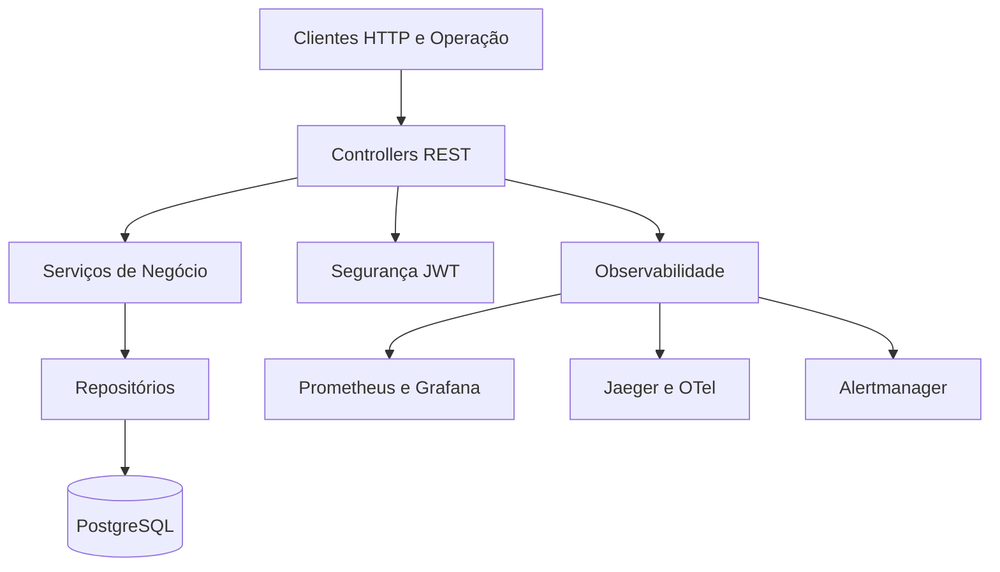

# Architecture and Design

Guia de arquitetura e organização funcional do Wallet Service API.

## 📐 Visão Geral

A aplicação adota uma arquitetura em camadas, com separação clara entre entrada HTTP, regras de negócio, persistência e infraestrutura operacional.

## 🗺️ Diagrama de camadas

## 🧱 Camadas da aplicação

### Apresentação
Responsável por expor endpoints REST, validar entradas e devolver respostas padronizadas.

### Negócio
Concentra as regras de autenticação, cadastro, carteira, transações, parâmetros e carga de dados.

### Persistência
Isola o acesso ao banco e mantém o modelo de entidades e relacionamentos da aplicação.

### Segurança
Protege os endpoints, aplica autenticação JWT e controla o contexto de acesso por perfil.

### Operação
Integra observabilidade, scripts locais, automação de ambiente, monitoramento e suporte à execução containerizada.

## 🧩 Domínios principais

### Autenticação
Gerencia login, emissão de tokens, renovação de sessão e recuperação do contexto autenticado.

### Clientes
Mantém os dados cadastrais e o vínculo com login e carteiras.

### Carteiras
Controla o estado da carteira, saldos e relação com o cliente.

### Transações
Executa depósitos, saques, transferências e consultas históricas.

### Parâmetros
Centraliza configurações funcionais da aplicação.

### Seeds e importações
Apoia a inicialização e o abastecimento de massa para ambientes locais e testes.

## 🔐 Segurança como parte da arquitetura

A segurança não está isolada em um único ponto. Ela participa de toda a jornada da requisição:

- validação de acesso logo na entrada HTTP
- separação de rotas públicas e protegidas
- propagação do contexto autenticado até a regra de negócio
- diferenciação entre rotas de usuário e rotas administrativas

## 📈 Arquitetura operacional

Além da API, o projeto inclui uma estrutura de apoio operacional:

- Docker Compose para ambiente integrado
- scripts para subida por grupos de serviço
- Vault para gestão de segredos no ambiente
- Prometheus, Grafana e Jaeger para telemetria
- Alertmanager para roteamento de alertas
- webhook da aplicação para recebimento de notificações operacionais

## 🔄 Fluxos relevantes

### Fluxo autenticado
Login, emissão de token, acesso às rotas protegidas e renovação de credenciais.

### Fluxo transacional
Operação financeira, persistência da movimentação e atualização do contexto da carteira.

### Fluxo operacional
Coleta de métricas, avaliação de regras de alerta, roteamento pelo Alertmanager e envio de webhook para a aplicação.

## 📌 Princípios adotados

- separação de responsabilidades
- segurança aplicada desde a borda da aplicação
- documentação orientada a uso e operação
- observabilidade integrada ao ambiente
- suporte a execução local e containerizada
