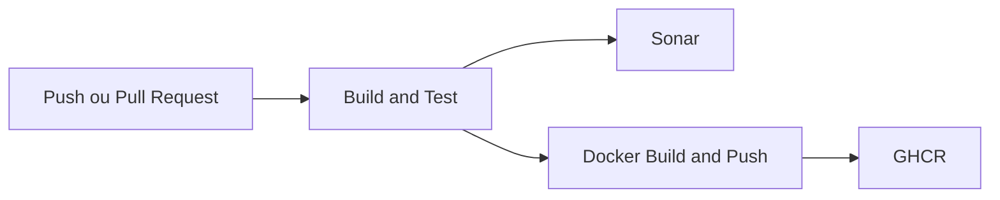

# Build and CI

Guia de build local, validação de qualidade e funcionamento do pipeline do Wallet Service API.

## 🎯 Objetivo

Garantir que a aplicação possa ser validada localmente e no fluxo automatizado de integração contínua, mantendo consistência entre desenvolvimento, revisão e publicação.

## 🧪 Build local

### Validação completa

```bash
./mvnw clean verify
```

### Testes

```bash
./mvnw test
```

### Cobertura

```bash
./mvnw test jacoco:report
```

### Script de qualidade

```bash
bash data/scripts/quality/wallet_quality.sh
```

## 🗺️ Fluxo do pipeline



## 🔄 Etapas do pipeline

### Build and Test
- checkout do código
- setup do Java 21
- preparação do Maven Wrapper
- execução de `verify` com testes e validações

### Sonar
- checkout com histórico completo
- preparação do ambiente Java
- uso de cache do Sonar
- análise de qualidade e cobertura

### Docker
- executado em fluxo de push para a branch principal
- autenticação no registry
- geração de tags de imagem
- build e publicação da imagem

## 📦 Resultado esperado

O pipeline cobre três dimensões principais:

- **confiabilidade de build**
- **qualidade técnica**
- **prontidão de publicação**

## 📌 Boas práticas

- validar localmente antes de abrir PR
- manter documentação alinhada com mudanças de comportamento
- revisar impactos de pipeline quando houver mudança em build, Docker, Sonar ou scripts de qualidade
