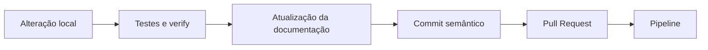

# Contributing

Guia para contribuição no Wallet Service API.

## 🎯 Objetivo

Manter a evolução do projeto com mudanças pequenas, rastreáveis, documentadas e compatíveis com o fluxo de validação local e do pipeline.

## 🚀 Como começar

### Fork e clone

```bash
git clone https://github.com/SEU_USUARIO/wallet-service-api.git
cd wallet-service-api
```

### Preparar branch de trabalho

```bash
git checkout -b feature/minha-alteracao
```

## 💻 Ambiente local

### Validar ferramentas

```bash
java -version
./mvnw -version
docker --version
```

### Executar a aplicação

```bash
./mvnw spring-boot:run -Dspring-boot.run.arguments="--spring.profiles.active=local"
```

### Executar com Docker

```bash
docker-compose up -d
```

## 🧪 Validação antes de entregar

### Testes

```bash
./mvnw test
```

### Cobertura

```bash
./mvnw test jacoco:report
```

### Verificação completa

```bash
./mvnw clean verify
```

### Script de qualidade

```bash
bash data/scripts/quality/wallet_quality.sh
```

## 🔄 Pipeline

O pipeline automatiza a validação básica do projeto.

### O que é validado
- checkout do código
- setup do Java 21
- build com Maven Wrapper
- execução de testes e verificações
- análise de qualidade com Sonar
- build e publicação Docker quando aplicável

### Quando considerar a entrega pronta
- build local sem erros
- testes consistentes
- documentação alinhada com a mudança
- impacto operacional revisado quando houver alteração em observabilidade, segurança ou scripts

### Fluxo recomendado de entrega



## 📝 Commits

Use mensagens objetivas e semânticas.

### Exemplos

```bash
git commit -m "feat(auth): ajusta fluxo de refresh token"
git commit -m "docs(api): atualiza guia de endpoints"
git commit -m "ci(pipeline): ajusta validação do build"
```

## 📚 Documentação

Toda mudança funcional, operacional ou de acesso deve refletir na documentação oficial.

### Atualize quando houver alteração em:
- endpoints
- autenticação ou autorização
- observabilidade e alertas
- fluxo operacional com Docker ou scripts
- comportamento validado no pipeline

## 🔐 Cuidados importantes

- não versionar segredos reais
- revisar impactos em rotas protegidas e administrativas
- validar compatibilidade com ambiente local e compose
- manter a documentação coerente com a experiência real de uso
