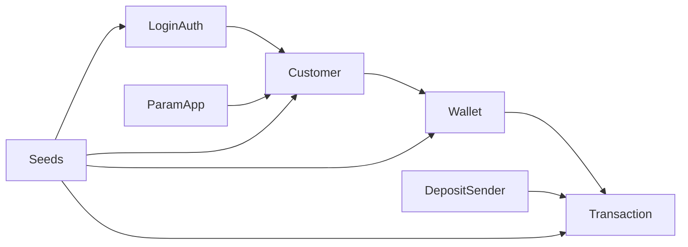

# Data Model

Guia do modelo de dados e das entidades principais do Wallet Service API.

## 🗄️ Visão Geral

O modelo de dados foi organizado para suportar autenticação, cadastro, carteira, transações e parametrização da aplicação.

## 🗺️ Relações principais

## 🧩 Entidades principais

### Customer
Representa o cliente da plataforma.

Responsabilidades principais:
- armazenar dados cadastrais
- manter vínculo com login
- servir como raiz funcional para carteira

### Wallet
Representa a carteira do cliente.

Responsabilidades principais:
- manter saldo e status
- registrar contexto da última operação
- servir como referência para as movimentações financeiras

### Transaction
Representa a base das movimentações financeiras.

A operação transacional é especializada em tipos como:
- depósito
- saque
- transferência enviada
- transferência recebida
- movimentações complementares de apoio ao histórico

### LoginAuth
Representa o acesso do usuário à aplicação.

Responsabilidades principais:
- armazenar identidade de login
- manter vínculo com cliente e carteira
- apoiar emissão de contexto autenticado e perfis de acesso

### ParamApp
Centraliza parâmetros funcionais da aplicação.

### DepositSender
Representa remetentes vinculados ao fluxo de depósitos.

## 🔗 Relacionamentos funcionais

### Cliente e login
Um cliente pode estar associado a um login para autenticação e uso das rotas protegidas.

### Cliente e carteira
O cliente é a referência principal para consulta e administração de carteiras.

### Carteira e transações
Toda operação financeira é vinculada a uma carteira e produz histórico rastreável.

## 📚 Enumerações de apoio

O modelo utiliza enumerações para padronizar estados e tipos, como:

- papéis de login
- status de cadastro e carteira
- tipo de operação
- status de transação

## 🌱 Seeds de dados

O projeto mantém arquivos de seed para apoio à inicialização e à preparação de ambiente.

### Conjuntos versionados
- clientes
- carteiras
- logins
- parâmetros
- transações
- movimentações
- remetentes de depósito

## 📌 Observações

- o modelo foi desenhado para suportar tanto o uso transacional da API quanto a operação assistida por carga inicial de dados
- as transações financeiras são o centro do histórico operacional da carteira
- parâmetros, login e observabilidade complementam o domínio principal de carteira digital
