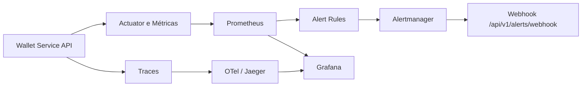

# Observability

Guia de monitoramento, métricas, tracing, dashboards e alertas do Wallet Service API.

## 🎯 Objetivo

A observabilidade permite acompanhar a saúde da aplicação e do ambiente por meio de métricas, traces, dashboards e notificações operacionais.

## 🧩 Componentes da stack

| Componente | Finalidade | Porta padrão |
|---|---|---|
| Prometheus | coleta e consulta de métricas | `9090` |
| Grafana | dashboards e acompanhamento visual | `3000` |
| Jaeger | análise de traces | `16686` |
| Alertmanager | roteamento e agrupamento de alertas | `9093` |
| OpenTelemetry Collector | recepção e encaminhamento de telemetria | `4317`, `4318`, `8889` |

## 🗺️ Fluxo de observabilidade



## 📈 Métricas da aplicação

As métricas da aplicação ficam disponíveis pelos endpoints de actuator e pelos serviços auxiliares do ambiente.

### Pontos de consulta
- health check
- métricas Prometheus da aplicação
- métricas técnicas dos componentes do ambiente
- traces coletados na jornada das requisições

## 📊 Dashboards

O Grafana é o ponto central de visualização operacional.

### Uso recomendado
- acompanhar disponibilidade da API
- monitorar latência e erros HTTP
- observar comportamento do banco e exporters
- correlacionar sinais de alerta com traces e métricas

## 🔔 Alertas

O ambiente conta com regras voltadas para cenários operacionais relevantes, como:

- indisponibilidade da aplicação
- aumento da taxa de erros 5xx
- latência elevada
- indisponibilidade do PostgreSQL
- indisponibilidade do exporter do PostgreSQL
- alta utilização de conexões do banco

## 🌐 Alertmanager e webhook

O Alertmanager agrupa e encaminha notificações para o webhook da aplicação.

### Endpoint de recebimento
- `POST /api/v1/alerts/webhook`

### Papel do webhook
- receber eventos gerados pela malha de monitoramento
- permitir tratamento centralizado das notificações
- fechar o fluxo operacional entre métrica, regra, alerta e resposta da aplicação

## 🚀 Subida da stack

### Docker Compose

```bash
docker-compose up -d prometheus grafana jaeger alertmanager otel-collector
```

### Script do projeto

```bash
./data/scripts/docker/wallet.sh up obs
```

## 💾 Operação do Grafana

O projeto disponibiliza utilitário próprio para acompanhamento, backup e restauração do Grafana.

```bash
bash data/scripts/grafana/grafana_ctl.sh status
bash data/scripts/grafana/grafana_ctl.sh backup
bash data/scripts/grafana/grafana_ctl.sh restore grafana/backup/grafana.db
```

## ✅ Verificações recomendadas

- validar disponibilidade da aplicação
- confirmar targets no Prometheus
- verificar dashboards no Grafana
- consultar traces no Jaeger
- conferir o fluxo de alerta até o webhook
