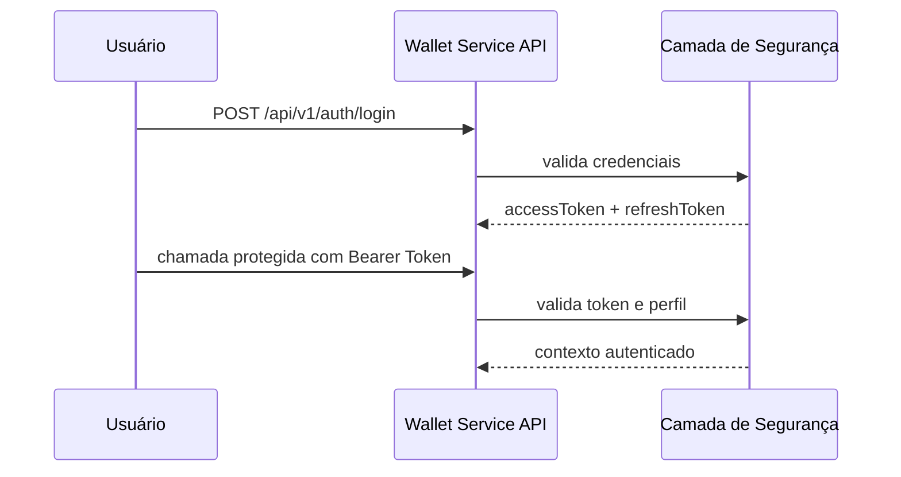

# Security

Guia de autenticação, autorização e controle de acesso do Wallet Service API.

## 🔐 Visão Geral

A segurança da aplicação foi organizada para separar rotas públicas, rotas autenticadas e rotas administrativas, mantendo o acesso baseado em JWT Bearer Token.

## 🔑 Autenticação

A autenticação ocorre por login e emissão de dois tokens:

- **access token** para uso nas chamadas protegidas
- **refresh token** para renovação da sessão autenticada

### Fluxo principal

1. o usuário realiza login
2. a API retorna os tokens
3. o cliente envia o `accessToken` no cabeçalho `Authorization`
4. a sessão pode ser renovada com o `refreshToken`

### Cabeçalho esperado

```http
Authorization: Bearer {accessToken}
```

## 🗺️ Fluxo de autenticação



## 👤 Perfis de acesso

### Público
Usado para rotas de autenticação inicial, documentação e serviços expostos para apoio operacional.

### Usuário autenticado
Usado para operações do próprio contexto, como perfil, carteira e transações pessoais.

### Administrativo
Usado para gestão global de clientes, carteiras, parâmetros, importações e rotas operacionais sensíveis.

## 🛡️ Contextos protegidos

### Autenticação
- login
- refresh token
- consulta do perfil autenticado
- cadastro de novos logins

### Negócio
- clientes
- carteiras
- transações
- consultas operacionais do usuário

### Administração
- gestão de parâmetros
- importação de dados
- carga inicial de seeds

## 🔄 Renovação de sessão

A renovação de sessão deve reaproveitar o refresh token emitido no login, evitando novo processo completo de autenticação sempre que a sessão precisar ser estendida.

## 🌐 Rotas operacionais

A aplicação também participa do fluxo operacional do ambiente.

### Webhook de alertas
O endpoint `/api/v1/alerts/webhook` recebe notificações do Alertmanager e faz parte da operação da stack de observabilidade.

### Seeder sob demanda
O endpoint `/api/v1/seeder/admin/run` apoia a carga inicial de dados para preparação de ambiente.

## ✅ Boas práticas

- proteger credenciais e segredos fora do código-fonte
- revisar acessos administrativos com atenção
- manter a documentação alinhada com os fluxos reais de autenticação e operação
- validar o comportamento de rotas públicas e operacionais em cada ambiente
