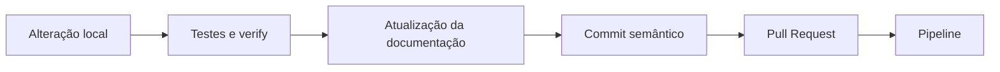

# Contributing

Guia para contribuição no Wallet Service API.

## 🎯 Objetivo

Manter a evolução do projeto com mudanças pequenas, rastreáveis, documentadas e compatíveis com o fluxo de validação local e do pipeline.

## 🚀 Como começar

### Fork e clone

```bash
git  clone  https://github.com/SEU_USUARIO/wallet-service-api.git

cd  wallet-service-api
```

### Preparar branch de trabalho

```bash

git  checkout  -b  feature/minha-alteracao

```

  

## 💻 Ambiente local

  

### Validar ferramentas

  

```bash

java  -version

./mvnw  -version

docker  --version

```

  

### Executar a aplicação

  

```bash

./mvnw  spring-boot:run  -Dspring-boot.run.arguments="--spring.profiles.active=local"

```

  

### Executar com Docker

  

```bash

docker-compose  up  -d

```

  

## 🧪 Validação antes de entregar

  

### Testes

  

```bash

./mvnw  test

```

  

### Cobertura

  

```bash

./mvnw  test  jacoco:report

```

  

### Verificação completa

  

```bash

./mvnw  clean  verify

```

  

### Script de qualidade

  

```bash

bash  data/scripts/quality/wallet_quality.sh

```

  

## 🔄 Pipeline

  

O pipeline automatiza a validação básica do projeto.

  

### O que é validado

- checkout do código

- setup do Java 21

- build com Maven Wrapper

- execução de testes e verificações

- análise de qualidade com Sonar

- build e publicação Docker quando aplicável

  

### Quando considerar a entrega pronta

- build local sem erros

- testes consistentes

- documentação alinhada com a mudança

- impacto operacional revisado quando houver alteração em observabilidade, segurança ou scripts

  

### Fluxo recomendado de entrega

  



----------

## 1. Template de Commit (Local)

O Git permite configurar um arquivo de mensagem padrão. Toda vez que você rodar `git commit` (sem o `-m`), o editor abrirá com este esqueleto para você preencher.

## Passo 1: Crie o arquivo `.gitmessage` na raiz do seu projeto:

Markdown

```
<tipo>(<escopo>): <resumo curto em minúsculas>

# ---------------------------------------------------------
# Escolha um tipo: 
#   feat: Nova funcionalidade
#   fix: Correção de bug
#   docs: Alteração na documentação
#   style: Formatação (espaços, vírgulas, etc)
#   refactor: Mudança de código que não altera comportamento
#   test: Adição ou correção de testes
#   chore: Atualização de build, dependências, etc.
# ---------------------------------------------------------

- O que foi feito:
- Por que foi feito:
- Arquivos impactados:

```

## Passo 2: Configure o Git para usar este arquivo:

Bash

```
git config commit.template .gitmessage

```

----------

## 2. Template de Pull Request (GitHub/GitLab)

Para que todos os PRs sigam o mesmo padrão de revisão, você pode criar um arquivo especial no seu repositório.

## Passo 1: Crie a pasta e o arquivo: `.github/PULL_REQUEST_TEMPLATE.md`

## Passo 2: Conteúdo sugerido (alinhado com suas premissas):

Markdown

```
## 📝 Descrição
Atualização da documentação técnica do projeto para refletir as últimas mudanças de arquitetura e segurança.

## 🛠️ O que mudou?
- [x] Documentação de API (`API_REFERENCE.md`)
- [x] Guia de Arquitetura (`ARCHITECTURE_AND_DESIGN.md`)
- [ ] Outros: 

## 🔗 Contexto Semântico
- **Tipo de alteração:** `docs`
- **Escopo:** `markdown` / `documentation`

## 🔐 Checklist de Segurança e Qualidade
- [ ] Validado localmente?
- [ ] Contém segredos ou credenciais versionadas? (Não)
- [ ] Compatível com Docker/Compose?
- [ ] Pipeline de CI passou?

## 📚 Documentação Relacionada
- [x] README.md atualizado
- [x] Documentos de Observabilidade e Segurança revisados

```
  


## 📚 Documentação

  

Toda mudança funcional, operacional ou de acesso deve refletir na documentação oficial.

  

### Atualize quando houver alteração em:

- endpoints

- autenticação ou autorização

- observabilidade e alertas

- fluxo operacional com Docker ou scripts

- comportamento validado no pipeline

  

## 🔐 Cuidados importantes

  

- não versionar segredos reais

- revisar impactos em rotas protegidas e administrativas

- validar compatibilidade com ambiente local e compose

- manter a documentação coerente com a experiência real de uso


🌐 Desenvolvimento Híbrido (Local + Kubernetes)

Para testar a aplicação localmente conectada a serviços que já estão rodando no  **Kind**  (como o Banco de Dados ou o OTEL Collector), utilizamos o  **Telepresence**. Isso permite usar os nomes dos serviços do Kubernetes sem precisar de  `localhost`  ou  `port-forward`.

Conectar ao Cluster

bash

```
# 1. Certifique-se que o Docker e o Kind estão rodando
kubectl get nodes

# 2. Conecte a rede local ao cluster
telepresence connect

```

Use o código com cuidado.

Validar Conexão

bash

```
# O Windows passará a resolver nomes internos do K8s
curl http://otel-collector:4318

```

Use o código com cuidado.

Configuração no Java

No seu  `application-local.yml`, mantenha as URLs originais do Kubernetes:

yaml

```
spring:
  datasource:
    url: jdbc:postgresql://postgres-service:5432/wallet_db
management:
  otlp:
    tracing:
      endpoint: http://otel-collector:4317

```

Use o código com cuidado.

----------

💡 Dica de Ouro

Se o comando  `telepresence connect`  falhar, tente limpar o daemon antes:

bash

```
telepresence quit -s && telepresence connect

```

Use o código com cuidado.

------
## O Gemini disse

Com certeza, Guga! Como você está consolidando a **v1.0.9** e migrando do Docker Compose direto para o **Kind (Kubernetes in Docker)**, ter um "Cheat Sheet" (guia rápido) é fundamental. No Kubernetes, a mentalidade muda um pouco: você não gerencia apenas containers, mas objetos (Pods, Deployments, ConfigMaps).

Aqui está o guia prático com os comandos que usamos e o que cada um faz no seu dia a dia de Tech Lead:

----------


# 🚀 Kind & Kubernetes: Guia de Operação (v1.0.9)

Este guia consolida os comandos essenciais para gerenciar o ciclo de vida da aplicação **Wallet Service API** dentro do cluster local **Kind**.

----------

## 🏗️ 1. Ciclo de Build e Deploy

Sempre que houver alteração no código Java ou no Dockerfile, siga esta sequência:

1.  **Gerar o JAR:**
    
    `./mvnw clean package -DskipTests`
    
2.  **Build da Imagem Docker:**
    
    `docker build -t wallet-service-api:1.0.9 .`
    
3.  **Carregar a imagem no Kind (Obrigatório):**
    
    `kind load docker-image wallet-service-api:1.0.9`
    
4.  **Aplicar os Manifestos:**
    
    `kubectl apply -f k8s/app/wallet-api.yaml`
    

----------

## 🔍 2. Inspeção e Monitoramento

Como saber se a aplicação "fixou" online e está saudável.

**Comando**

**Finalidade**

`kubectl get pods`

Lista todos os Pods e seus status (Running, CrashLoop, etc).

`kubectl get deployments`

Verifica se as réplicas desejadas estão ativas.

`kubectl get services`

Lista as portas expostas (NodePort) e IPs internos.

`kubectl get configmap`

Lista as configurações injetadas (ex: `tempo-conf`).

`kubectl describe pod <nome>`

Mostra eventos detalhados (erros de memória, CPU ou Probes).

----------

## 🛠️ 3. Troubleshooting (Debug)

O que fazer quando o log para ou o Pod reinicia sozinho.

-   **Log em tempo real:**
    
    `kubectl logs -f deployment/wallet-api`
    
-   **Log da instância que crashou (Anterior):**
    
    `kubectl logs deployment/wallet-api --previous`
    
-   **Ver timestamps no log:**
    
    `kubectl logs -f deployment/wallet-api --timestamps`
    
-   **Entrar no container para validar arquivos:**
    
    `kubectl exec -it deployment/wallet-api -- bash`
    

----------

## ⚙️ 4. Gestão de Configuração (ConfigMaps)

Para arquivos que estão fora do JAR (como o `tempo.yaml`).

-   **Criar ConfigMap de um arquivo local:**
    
    `kubectl create configmap tempo-conf --from-file=tempo.yaml=grafana-tempo/tempo.yaml`
    
-   **Atualizar um ConfigMap (Deletar e Criar):**
    
    `kubectl delete configmap tempo-conf && kubectl create configmap tempo-conf --from-file=tempo.yaml=grafana-tempo/tempo.yaml`
    
-   **Reiniciar a App para ler o novo ConfigMap:**
    
    `kubectl rollout restart deployment wallet-api`
    

----------

## 🧹 5. Comandos de Limpeza

-   **Remover a aplicação:** `kubectl delete -f k8s/app/wallet-api.yaml`
    
-   **Remover o cluster Kind:** `kind delete cluster`
    

----------

## 💡 Dicas de Tech Lead:

-   **ImagePullPolicy:** No seu YAML, use `imagePullPolicy: IfNotPresent`. Isso força o Kubernetes a usar a imagem que você carregou via `kind load` em vez de tentar buscar na internet.
    
-   **Probes:** Se a aplicação demorar mais de 60s para subir, ajuste o `initialDelaySeconds` no Deployment para evitar o reinício forçado pelo K8s.


--

## 📊 Diagrama C4 (Container Level) - Wallet Service API

Snippet de código

```
C4Container
    title Container Diagram for Wallet Service API (v1.0.9)

    Person(user, "Customer / Admin", "Usuário que interage com a carteira ou parâmetros.")
    
    System_Boundary(k8s_boundary, "Kubernetes Cluster (Kind)") {
        
        Container(api, "Wallet Service API", "Java 21, Spring Boot 3.4", "Gerencia transações, clientes e segurança JWT.")
        
        ContainerDb(postgres, "PostgreSQL", "Database", "Armazena dados de transações, usuários e wallets.")
        
        Container(vault, "HashiCorp Vault", "Secrets Management", "Armazena chaves sensíveis e segredos dinâmicos.")
        
        Container_Boundary(observability_boundary, "Observability Stack") {
            Container(otel, "OTel Collector", "OpenTelemetry", "Recebe Traces e Logs via OTLP (4317/4318).")
            Container(tempo, "Grafana Tempo", "Distributed Tracing", "Armazena e indexa traces da v1.0.9.")
            Container(grafana, "Grafana", "Dashboard", "Visualização de métricas e traces.")
        }
    }

    Rel(user, api, "Faz requisições HTTPS", "JSON/JWT")
    Rel(api, postgres, "Persiste dados", "JDBC/JPA")
    Rel(api, vault, "Busca segredos no boot", "AppRole/Token")
    Rel(api, otel, "Envia Logs e Traces", "OTLP/gRPC")
    Rel(otel, tempo, "Exporta spans", "gRPC")
    Rel(grafana, tempo, "Consulta traces", "HTTP")

```

----------

## O que esse diagrama explica sobre o seu erro de hoje:

1.  **Dependência de Boot (Vault/Postgres):** Note como a `api` depende do `vault` e do `postgres`. Se um deles demora, o Spring trava no boot, o que explica os 73 segundos que vimos no log.
    
2.  **O Fluxo do Tempo:** O diagrama mostra que a API não fala direto com o Tempo, ela fala com o **OTel Collector**, que por sua vez entrega para o **Tempo**. Se o arquivo `tempo.yaml` estiver errado, essa última setinha quebra.
    
3.  **Segurança JWT:** O usuário envia o token que é validado contra o `JWT_SECRET` (aquele de 14 caracteres) que a API leu do ambiente ou do Vault.
    

----------

## Dica de Tech Lead:

Para manter seu projeto profissional, você pode salvar esse código acima em um arquivo chamado `architecture.mmd` ou colocar direto no `README.md` usando:

Markdown

```
### Arquitetura
```mermaid
[codigo aqui]
```

