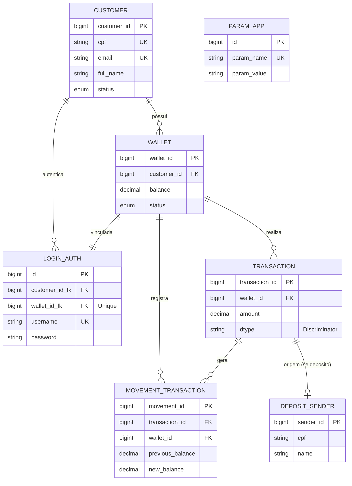

# Data Model

Documentação do modelo de dados, schema e relacionamentos do Wallet Service API.

## 🗄️ Visão Geral do Banco de Dados

**SGBD Suportado:** PostgreSQL 15.3+ (Produção) | H2 (Desenvolvimento)

**Tipo de Herança JPA:** JOINED Inheritance

## 📊 Tabelas e Entidades

### 1. TB_CUSTOMER (Clientes)

Armazena informações dos clientes do sistema.

**Tabela SQL:**
```sql
CREATE TABLE tb_customer (
    customer_id BIGINT PRIMARY KEY,
    document_id VARCHAR(20) NOT NULL,
    cpf VARCHAR(20) NOT NULL UNIQUE,
    birth_date DATE NOT NULL,
    first_name VARCHAR(30) NOT NULL,
    last_name VARCHAR(30) NOT NULL,
    full_name VARCHAR(80) NOT NULL,
    email VARCHAR(80) NOT NULL UNIQUE,
    phone_number VARCHAR(20) NOT NULL,
    status INTEGER NOT NULL,
    created_at TIMESTAMP(6) NOT NULL,
    updated_at TIMESTAMP(6) NOT NULL,
    login_auth_id_fk BIGINT
);
```

**Entidade JPA:**
```java
@Entity
@Table(name = "tb_customer")
@Builder(toBuilder = true)
@Getter
@Setter
@NoArgsConstructor
@AllArgsConstructor
@EqualsAndHashCode(of = "customerId")
public class Customer {
    @Id
    @Column(name = "customer_id", nullable = false, unique = true)
    private Long customerId;

    @NotBlank(message = "Document ID field is required")
    @Column(name = "documentId", nullable = false, length = 20)
    private String documentId;

    @Pattern(regexp = "^\\d{3}\\.\\d{3}\\.\\d{3}-\\d{2}$", message = "CPF field is required")
    @Column(name = "cpf", unique = true, nullable = false, length = 20)
    private String cpf;

    @JsonFormat(shape = JsonFormat.Shape.STRING, pattern = "yyyy-MM-dd")
    @Column(name = "birth_Date", nullable = false)
    private LocalDate birthDate;

    @NotBlank(message = "FirstName is required.")
    @Column(name = "first_Name", nullable = false, length = 30)
    private String firstName;

    @NotBlank(message = "LastName is Required.")
    @Column(name = "last_Name", nullable = false, length = 30)
    private String lastName;

    @Email(message = "Email should be valid")
    @Column(name = "email", unique = true, nullable = false, length = 80)
    private String email;

    @NotBlank(message = "Fullname is required")
    @Column(name = "full_name", nullable = false, length = 80)
    private String fullName;

    @NotNull(message = "Phone number cannot be null")
    @Pattern(regexp = "^\\(\\d{2}\\)\\s*9?\\d{4}-\\d{4}$", message = "Phone number must be in the format")
    @Column(name = "phone_number", nullable = false, length = 20)
    private String phoneNumber;

    @JsonFormat(shape = JsonFormat.Shape.STRING, pattern = "yyyy-MM-dd'T'HH:mm:ss")
    @Column(name = "created_at", nullable = false)
    private LocalDateTime createdAt;

    @JsonFormat(shape = JsonFormat.Shape.STRING, pattern = "yyyy-MM-dd'T'HH:mm:ss")
    @Column(name = "updated_at", nullable = false)
    private LocalDateTime updatedAt;

    @Convert(converter = StatusConverter.class)
    @Column(name = "status", nullable = false, length = 2)
    private Status status;

    @Column(name = "login_auth_id_fk", nullable = true, insertable = true, updatable = true)
    private Long loginAuthId;
}
```

**Campos:**

| Campo | Tipo | Restrições | Descrição |
|-------|------|-----------|----------|
| `customer_id` | BIGINT | PK | Identificador único |
| `document_id` | VARCHAR(20) | NOT NULL | Documento de identidade |
| `cpf` | VARCHAR(20) | UNIQUE, NOT NULL | CPF formatado |
| `birth_date` | DATE | NOT NULL | Data de nascimento |
| `first_name` | VARCHAR(30) | NOT NULL | Primeiro nome |
| `last_name` | VARCHAR(30) | NOT NULL | Sobrenome |
| `full_name` | VARCHAR(80) | NOT NULL | Nome completo |
| `email` | VARCHAR(80) | UNIQUE, NOT NULL | Email |
| `phone_number` | VARCHAR(20) | NOT NULL | Telefone |
| `status` | INTEGER | NOT NULL | Status (converter) |
| `created_at` | TIMESTAMP | NOT NULL | Data de criação |
| `updated_at` | TIMESTAMP | NOT NULL | Data de atualização |
| `login_auth_id_fk` | BIGINT | - | FK para LoginAuth |

---

### 2. TB_WALLET (Carteiras)

Armazena carteiras digitais dos clientes.

**Tabela SQL:**
```sql
CREATE TABLE tb_wallet (
    wallet_id BIGINT PRIMARY KEY,
    customer_id_fk BIGINT NOT NULL,
    last_operation_type INTEGER,
    previous_balance NUMERIC(16,2) NOT NULL,
    current_balance NUMERIC(16,2) NOT NULL,
    status INTEGER NOT NULL,
    created_at TIMESTAMP(6) NOT NULL,
    updated_at TIMESTAMP(6) NOT NULL,
    login_user VARCHAR(20) NOT NULL,
    FOREIGN KEY (customer_id_fk) REFERENCES tb_customer(customer_id)
);
```

**Entidade JPA:**
```java
@Entity
@Table(name = "tb_wallet")
@Builder(toBuilder = true)
@Getter
@Setter
@NoArgsConstructor
@AllArgsConstructor
@EqualsAndHashCode(of = "walletId")
public class Wallet {
    @Id
    @Column(name = "wallet_id", nullable = false, unique = true)
    private Long walletId;

    @NotNull(message = "Customer ID cannot be null")
    @Column(name = "customer_id_fk", insertable = true, updatable = true)
    private Long customerId;

    @ManyToOne(fetch = FetchType.LAZY)
    @JoinColumn(name = "customer_id_fk", referencedColumnName = "customer_id", nullable = false, insertable = false, updatable = false)
    private Customer customer;

    @Convert(converter = OperationTypeConverter.class)
    @JsonProperty("lastOperationType")
    @JsonFormat(shape = JsonFormat.Shape.STRING)
    @Column(name = "last_operation_type", nullable = true, length = 2, insertable = true, updatable = true)
    private OperationType lastOperationType;

    @Digits(integer = 14, fraction = 2, message = "Previous balance must have up to 14 integer digits and 2 decimal places")
    @Column(name = "previous_balance", nullable = false)
    private BigDecimal previousBalance;

    @Digits(integer = 14, fraction = 2, message = "Current balance must have up to 14 integer digits and 2 decimal places")
    @Column(name = "current_balance", nullable = false)
    private BigDecimal currentBalance;

    @Convert(converter = StatusConverter.class)
    @Column(name = "status", nullable = false, length = 2, insertable = true, updatable = true)
    private Status status;

    @JsonFormat(shape = JsonFormat.Shape.STRING, pattern = "yyyy-MM-dd'T'HH:mm:ss")
    @Column(name = "created_At", nullable = false)
    private LocalDateTime createdAt;

    @JsonFormat(shape = JsonFormat.Shape.STRING, pattern = "yyyy-MM-dd'T'HH:mm:ss")
    @Column(name = "updated_At", nullable = false)
    private LocalDateTime updatedAt;
}
```

**Campos:**

| Campo | Tipo | Restrições | Descrição |
|-------|------|-----------|----------|
| `wallet_id` | BIGINT | PK | Identificador único |
| `customer_id_fk` | BIGINT | FK, NOT NULL | Referência ao cliente |
| `last_operation_type` | INTEGER | - | Última operação (converter) |
| `previous_balance` | NUMERIC(16,2) | NOT NULL | Saldo anterior |
| `current_balance` | NUMERIC(16,2) | NOT NULL | Saldo atual |
| `status` | INTEGER | NOT NULL | Status (converter) |
| `created_at` | TIMESTAMP | NOT NULL | Data de criação |
| `updated_at` | TIMESTAMP | NOT NULL | Data de atualização |
| `login_user` | VARCHAR(20) | NOT NULL | Usuário que logou |

---

### 3. TB_TRANSACTION (Transações)

Classe abstrata base para transações, usando herança JOINED.

**Estratégia de Herança:** JOINED Inheritance

**Tabela SQL:**
```sql
CREATE TABLE tb_transaction (
    transaction_id BIGINT PRIMARY KEY,
    login VARCHAR(25) NOT NULL,
    wallet_id BIGINT NOT NULL,
    operation_type INTEGER NOT NULL,
    previous_balance NUMERIC(16,2) NOT NULL,
    amount NUMERIC(16,2) NOT NULL,
    current_balance NUMERIC(16,2) NOT NULL,
    status_transaction INTEGER NOT NULL,
    created_at TIMESTAMP(6) NOT NULL,
    movement_id_fk BIGINT,
    FOREIGN KEY (wallet_id_fk) REFERENCES tb_wallet(wallet_id),
    FOREIGN KEY (movement_id_fk) REFERENCES tb_movement_transfer(movement_id)
);
```

**Entidade JPA:**
```java
@Inheritance(strategy = InheritanceType.JOINED)
@JsonTypeInfo(use = JsonTypeInfo.Id.NAME, include = JsonTypeInfo.As.EXISTING_PROPERTY, property = "operationType", visible = true)
@JsonSubTypes({
    @JsonSubTypes.Type(value = DepositMoney.class, name = "DEPOSIT"),
    @JsonSubTypes.Type(value = WithdrawMoney.class, name = "WITHDRAW"),
    @JsonSubTypes.Type(value = TransferMoneySend.class, name = "TRANSFER_SEND"),
    @JsonSubTypes.Type(value = TransferMoneyReceived.class, name = "TRANSFER_RECEIVED")
})
@Entity
@Table(name = "tb_transaction")
@SuperBuilder
@Getter
@Setter
@NoArgsConstructor
@AllArgsConstructor
@EqualsAndHashCode(of = "transactionId")
public abstract class Transaction {
    @Id
    @Column(name = "transaction_id", nullable = false, unique = true)
    private Long transactionId;

    @Column(name = "login", nullable = false, length = 25)
    private String login;

    @NotNull(message = "Wallet ID cannot be null")
    @Column(name = "wallet_id", nullable = false)
    private Long walletId;

    @ManyToOne(fetch = FetchType.LAZY)
    @JoinColumn(name = "wallet_id", referencedColumnName = "wallet_id", insertable = false, updatable = false)
    private Wallet wallet;

    @Convert(converter = OperationTypeConverter.class)
    @Column(name = "operation_type", nullable = false, length = 2)
    @JsonProperty("operationType")
    @JsonFormat(shape = JsonFormat.Shape.STRING)
    private OperationType operationType;

    @Digits(integer = 14, fraction = 2)
    @Column(name = "previous_Balance", nullable = false)
    private BigDecimal previousBalance;

    @Digits(integer = 14, fraction = 2)
    @Column(name = "amount", nullable = false)
    private BigDecimal amount;

    @Digits(integer = 14, fraction = 2)
    @Column(name = "current_Balance", nullable = false)
    private BigDecimal currentBalance;

    @Convert(converter = StatusTransactionConverter.class)
    @Column(name = "status_transaction", nullable = false, length = 2)
    StatusTransaction statusTransaction;

    @JsonFormat(shape = JsonFormat.Shape.STRING, pattern = "yyyy-MM-dd'T'HH:mm:ss")
    @Column(name = "created_at", nullable = false)
    private LocalDateTime createdAt;

    @ManyToOne(fetch = FetchType.LAZY)
    @JoinColumn(name = "movement_id_fk", referencedColumnName = "movement_id", nullable = true, insertable = true, updatable = false)
    private MovementTransaction movementTransaction;
}
```

---

### 3.1 TB_DEPOSIT_MONEY (Depósito)

**Tabela SQL:**
```sql
CREATE TABLE tb_deposit_money (
    transaction_id BIGINT PRIMARY KEY,
    deposit_sender_id_fk BIGINT UNIQUE,
    FOREIGN KEY (transaction_id) REFERENCES tb_transaction(transaction_id),
    FOREIGN KEY (deposit_sender_id_fk) REFERENCES deposit_sender(deposit_sender_id)
);
```

**Entidade JPA:**
```java
@Entity
@Table(name = "tb_deposit_money")
@Data
@NoArgsConstructor
@EqualsAndHashCode(callSuper = true, onlyExplicitlyIncluded = true)
@SuperBuilder
public class DepositMoney extends Transaction {
    @OneToOne(fetch = FetchType.LAZY)
    @JoinColumn(name = "deposit_sender_id_fk", referencedColumnName = "deposit_sender_id", nullable = true, insertable = true, updatable = false)
    private DepositSender depositSender;
}
```

---

### 3.2 TB_WITHDRAW (Saque)

**Tabela SQL:**
```sql
CREATE TABLE tb_withdraw (
    transaction_id BIGINT PRIMARY KEY,
    FOREIGN KEY (transaction_id) REFERENCES tb_transaction(transaction_id)
);
```

**Entidade JPA:**
```java
@Entity
@Table(name = "tb_withdraw")
@Data
@NoArgsConstructor
@EqualsAndHashCode(callSuper = true, onlyExplicitlyIncluded = true)
@SuperBuilder
public class WithdrawMoney extends Transaction {
    // Sem campos adicionais
}
```

---

### 3.3 TB_TRANSFER_SEND (Transferência Enviada)

**Tabela SQL:**
```sql
CREATE TABLE tb_transfer_send (
    transaction_id BIGINT PRIMARY KEY,
    FOREIGN KEY (transaction_id) REFERENCES tb_transaction(transaction_id)
);
```

**Entidade JPA:**
```java
@Entity
@Table(name = "tb_transfer_send")
@Data
@NoArgsConstructor
@EqualsAndHashCode(callSuper = true, onlyExplicitlyIncluded = true)
@SuperBuilder
public class TransferMoneySend extends Transaction {
    // Sem campos adicionais
}
```

---

### 3.4 TB_TRANSFER_RECEIVED (Transferência Recebida)

**Tabela SQL:**
```sql
CREATE TABLE tb_transfer_received (
    transaction_id BIGINT PRIMARY KEY,
    FOREIGN KEY (transaction_id) REFERENCES tb_transaction(transaction_id)
);
```

**Entidade JPA:**
```java
@Entity
@Table(name = "tb_transfer_received")
@Data
@NoArgsConstructor
@EqualsAndHashCode(callSuper = true, onlyExplicitlyIncluded = true)
@SuperBuilder
public class TransferMoneyReceived extends Transaction {
    // Sem campos adicionais
}
```

---

### 4. TB_MOVEMENT_TRANSFER (Movimentação de Transferência)

**Tabela SQL:**
```sql
CREATE TABLE tb_movement_transfer (
    movement_id BIGINT PRIMARY KEY,
    amount NUMERIC(16,2) NOT NULL,
    operation_type INTEGER NOT NULL,
    created_at TIMESTAMP(6) NOT NULL,
    transaction_id BIGINT NOT NULL,
    transaction_to_id BIGINT,
    wallet_id BIGINT NOT NULL,
    wallet_to_id BIGINT,
    FOREIGN KEY (transaction_id) REFERENCES tb_transaction(transaction_id),
    FOREIGN KEY (transaction_to_id) REFERENCES tb_transaction(transaction_id),
    FOREIGN KEY (wallet_id) REFERENCES tb_wallet(wallet_id),
    FOREIGN KEY (wallet_to_id) REFERENCES tb_wallet(wallet_id)
);
```

---

### 5. DEPOSIT_SENDER (Remetente de Depósito)

**Tabela SQL:**
```sql
CREATE TABLE deposit_sender (
    deposit_sender_id BIGINT PRIMARY KEY,
    amount NUMERIC(16,2) NOT NULL,
    created_at TIMESTAMP(6) NOT NULL,
    cpf VARCHAR(20) NOT NULL,
    full_name VARCHAR(30) NOT NULL,
    terminal_id VARCHAR(255) NOT NULL
);
```

---

### 6. TB_LOGIN_AUTH (Autenticação de Login)

**Tabela SQL:**
```sql
CREATE TABLE tb_login_auth (
    id BIGINT PRIMARY KEY,
    status INTEGER NOT NULL,
    customer_id_fk BIGINT NOT NULL,
    wallet_id_fk BIGINT NOT NULL UNIQUE,
    login_auth_type INTEGER NOT NULL,
    login VARCHAR(80) NOT NULL,
    access_key VARCHAR(256) NOT NULL,
    created_at TIMESTAMP(6) NOT NULL,
    updated_at TIMESTAMP(6) NOT NULL,
    last_login_at TIMESTAMP(6),
    role INTEGER
);
```

**Entidade JPA:**
```java
@Entity
@Table(name = "tb_login_auth")
@Builder(toBuilder = true)
@Getter
@Setter
@NoArgsConstructor
@AllArgsConstructor
@EqualsAndHashCode(of = "id")
public class LoginAuth {
    @Id
    @Column(name = "id", nullable = false, unique = true)
    @JsonProperty("id")
    private Long id;

    @Convert(converter = StatusConverter.class)
    @Column(name = "status", nullable = false, length = 2)
    private Status status;

    @NotNull(message = "Customer cannot be null")
    @Column(name = "customer_id_fk", nullable = false)
    private Long customerId;

    @NotNull(message = "Wallet cannot be null")
    @Column(name = "wallet_id_fk", nullable = false, unique = true)
    private Long walletId;

    @Convert(converter = LoginAuthTypeConverter.class)
    @Column(name = "loginAuthType", nullable = false, length = 2)
    private LoginAuthType loginAuthType;

    @Column(name = "login", nullable = false, length = 80)
    private String login;

    @Column(name = "access_key", nullable = false, length = 256)
    private String accessKey;

    @JsonFormat(shape = JsonFormat.Shape.STRING, pattern = "yyyy-MM-dd'T'HH:mm:ss")
    @Column(name = "created_at", nullable = false)
    private LocalDateTime createdAt;

    @JsonFormat(shape = JsonFormat.Shape.STRING, pattern = "yyyy-MM-dd'T'HH:mm:ss")
    @Column(name = "updated_at", nullable = false)
    private LocalDateTime updatedAt;

    @JsonFormat(shape = JsonFormat.Shape.STRING, pattern = "yyyy-MM-dd'T'HH:mm:ss")
    @Column(name = "last_login_at", nullable = true)
    private LocalDateTime lastLoginAt;

    @Convert(converter = LoginRoleConverter.class)
    @Column(name = "role", length = 180)
    private LoginRole role;
}
```

---

**Visão Geral da Herança:**
```
Transaction (Abstract)
├── DepositMoney
├── WithdrawMoney
├── TransferMoneySend
└── TransferMoneyReceived
```

**Tipo de Herança JPA:** JOINED Inheritance (cada subclasse tem sua própria tabela)

**Enumeração Status:**
```java
public enum Status {
    ACTIVE("Ativo"),
    INACTIVE("Inativo");
}
```

---

### 2. WALLETS (Carteiras)

Armazena carteiras digitais dos clientes.

**Tabela SQL:**
```sql
CREATE TABLE wallets (
    wallet_id BIGSERIAL PRIMARY KEY,
    customer_id BIGINT NOT NULL,
    wallet_type VARCHAR(50),
    balance DECIMAL(18,2) NOT NULL DEFAULT 0,
    status VARCHAR(20) NOT NULL DEFAULT 'ACTIVE',
    created_at TIMESTAMP NOT NULL DEFAULT CURRENT_TIMESTAMP,
    updated_at TIMESTAMP NOT NULL DEFAULT CURRENT_TIMESTAMP,
    FOREIGN KEY (customer_id) REFERENCES customers(customer_id) ON DELETE CASCADE,
    CONSTRAINT chk_balance CHECK (balance >= 0),
    CONSTRAINT chk_wallet_status CHECK (status IN ('ACTIVE', 'INACTIVE', 'SUSPENDED'))
);

CREATE INDEX idx_wallets_customer_id ON wallets(customer_id);
CREATE INDEX idx_wallets_status ON wallets(status);
CREATE INDEX idx_wallets_created_at ON wallets(created_at);
```

**Entidade JPA:**
```java
@Entity
@Table(name = "wallets")
@Data
@Builder
@NoArgsConstructor
@AllArgsConstructor
public class Wallet {
    @Id
    @GeneratedValue(strategy = GenerationType.IDENTITY)
    private Long walletId;
    
    @ManyToOne(fetch = FetchType.LAZY)
    @JoinColumn(name = "customer_id", nullable = false)
    private Customer customer;
    
    @Column(name = "customer_id", insertable = false, updatable = false)
    private Long customerId;
    
    @Column(length = 50)
    private String walletType;
    
    @Column(nullable = false, precision = 18, scale = 2)
    private BigDecimal balance;
    
    @Enumerated(EnumType.STRING)
    @Column(nullable = false)
    private Status status;
    
    @CreationTimestamp
    @Column(nullable = false, updatable = false)
    private LocalDateTime createdAt;
    
    @UpdateTimestamp
    @Column(nullable = false)
    private LocalDateTime updatedAt;
    
    @OneToMany(mappedBy = "wallet", cascade = CascadeType.ALL)
    private List<Transaction> transactions;
}
```

**Campos:**

| Campo | Tipo | Restrições | Descrição |
|-------|------|-----------|----------|
| `wallet_id` | BIGINT | PK, AUTO | Identificador único |
| `customer_id` | BIGINT | FK, NOT NULL | Referência ao cliente |
| `wallet_type` | VARCHAR(50) | - | Tipo: SAVINGS, CHECKING, etc |
| `balance` | DECIMAL(18,2) | NOT NULL, >= 0 | Saldo atual |
| `status` | ENUM | NOT NULL | ACTIVE, INACTIVE, SUSPENDED |
| `created_at` | TIMESTAMP | NOT NULL | Data de criação |
| `updated_at` | TIMESTAMP | NOT NULL | Data de atualização |

**Relacionamento:**
```
Customer 1 ---> * Wallet
```
- Cascata de delete: Ao deletar customer, todas wallets são deletadas
- Fetch type: LAZY (carrega sob demanda)

---

### 3. TRANSACTIONS (Transações)

Armazena transações financeiras (Depósito, Saque, Transferência).

**Estratégia de Herança:** Single Table Inheritance

**Tabela SQL:**
```sql
CREATE TABLE transactions (
    transaction_id BIGSERIAL PRIMARY KEY,
    wallet_id BIGINT NOT NULL,
    amount DECIMAL(18,2) NOT NULL,
    transaction_type VARCHAR(50) NOT NULL,
    status VARCHAR(20) NOT NULL DEFAULT 'PENDING',
    
    -- Colunas para diferentes tipos
    cpf_sender VARCHAR(11),
    sender_name VARCHAR(255),
    terminal_id VARCHAR(100),
    wallet_id_send BIGINT,
    wallet_id_received BIGINT,
    
    -- Discriminator para JPA
    dtype VARCHAR(50) NOT NULL,
    
    created_at TIMESTAMP NOT NULL DEFAULT CURRENT_TIMESTAMP,
    updated_at TIMESTAMP NOT NULL DEFAULT CURRENT_TIMESTAMP,
    
    FOREIGN KEY (wallet_id) REFERENCES wallets(wallet_id) ON DELETE CASCADE,
    CONSTRAINT chk_transaction_status CHECK (
        status IN ('PENDING', 'COMPLETED', 'FAILED', 'CANCELLED')
    ),
    CONSTRAINT chk_amount CHECK (amount > 0)
);

CREATE INDEX idx_transactions_wallet_id ON transactions(wallet_id);
CREATE INDEX idx_transactions_type ON transactions(dtype);
CREATE INDEX idx_transactions_created_at ON transactions(created_at);
CREATE INDEX idx_transactions_status ON transactions(status);
```

**Entidade Base:**
```java
@Entity
@Table(name = "transactions")
@Inheritance(strategy = InheritanceType.SINGLE_TABLE)
@DiscriminatorColumn(name = "dtype", discriminatorType = DiscriminatorType.STRING)
@Data
@NoArgsConstructor
@AllArgsConstructor
public abstract class Transaction {
    @Id
    @GeneratedValue(strategy = GenerationType.IDENTITY)
    private Long transactionId;
    
    @ManyToOne(fetch = FetchType.LAZY)
    @JoinColumn(name = "wallet_id", nullable = false)
    private Wallet wallet;
    
    @Column(name = "wallet_id", insertable = false, updatable = false)
    private Long walletId;
    
    @Column(nullable = false, precision = 18, scale = 2)
    private BigDecimal amount;
    
    @Enumerated(EnumType.STRING)
    @Column(nullable = false)
    private StatusTransaction status;
    
    @CreationTimestamp
    @Column(nullable = false, updatable = false)
    private LocalDateTime createdAt;
    
    @UpdateTimestamp
    @Column(nullable = false)
    private LocalDateTime updatedAt;
}
```

#### 3.1 DEPOSIT_MONEY (Depósito)

```java
@Entity
@DiscriminatorValue("DEPOSIT")
@Data
@NoArgsConstructor
@AllArgsConstructor
public class DepositMoney extends Transaction {
    
    @Column(length = 11)
    private String cpfSender;
    
    @Column(length = 255)
    private String senderName;
    
    @Column(length = 100)
    private String terminalId;
}
```

**Exemplo SQL:**
```sql
INSERT INTO transactions (
    wallet_id, amount, transaction_type, status,
    cpf_sender, sender_name, terminal_id, dtype
) VALUES (
    1, 500.00, 'DEPOSIT', 'COMPLETED',
    '12345678901', 'João Silva', 'TERM001', 'DEPOSIT'
);
```

#### 3.2 WITHDRAW_MONEY (Saque)

```java
@Entity
@DiscriminatorValue("WITHDRAW")
@Data
@NoArgsConstructor
@AllArgsConstructor
public class WithdrawMoney extends Transaction {
    // Sem campos adicionais
}
```

#### 3.3 TRANSFER_MONEY_SEND (Transferência - Envio)

```java
@Entity
@DiscriminatorValue("TRANSFER_SEND")
@Data
@NoArgsConstructor
@AllArgsConstructor
public class TransferMoneySend extends Transaction {
    
    @Column(name = "wallet_id_received")
    private Long walletIdReceived;
    
    @ManyToOne(fetch = FetchType.LAZY)
    @JoinColumn(name = "wallet_id_received", insertable = false, updatable = false)
    private Wallet walletReceived;
}
```

#### 3.4 TRANSFER_MONEY_RECEIVED (Transferência - Recebimento)

```java
@Entity
@DiscriminatorValue("TRANSFER_RECEIVED")
@Data
@NoArgsConstructor
@AllArgsConstructor
public class TransferMoneyReceived extends Transaction {
    
    @Column(name = "wallet_id_send")
    private Long walletIdSend;
    
    @ManyToOne(fetch = FetchType.LAZY)
    @JoinColumn(name = "wallet_id_send", insertable = false, updatable = false)
    private Wallet walletSend;
}
```

**Enumeração StatusTransaction:**
```java
public enum StatusTransaction {
    PENDING("Pendente"),
    COMPLETED("Concluído"),
    FAILED("Falha"),
    CANCELLED("Cancelado");
}
```

---

### 4. MOVEMENT_TRANSACTIONS (Movimentações)

Armazena histórico detalhado de movimentações.

**Tabela SQL:**
```sql
CREATE TABLE movement_transactions (
    movement_id BIGSERIAL PRIMARY KEY,
    transaction_id BIGINT NOT NULL,
    wallet_id BIGINT NOT NULL,
    previous_balance DECIMAL(18,2) NOT NULL,
    new_balance DECIMAL(18,2) NOT NULL,
    operation_type VARCHAR(50) NOT NULL,
    created_at TIMESTAMP NOT NULL DEFAULT CURRENT_TIMESTAMP,
    FOREIGN KEY (transaction_id) REFERENCES transactions(transaction_id) ON DELETE CASCADE,
    FOREIGN KEY (wallet_id) REFERENCES wallets(wallet_id) ON DELETE CASCADE
);

CREATE INDEX idx_movements_transaction_id ON movement_transactions(transaction_id);
CREATE INDEX idx_movements_wallet_id ON movement_transactions(wallet_id);
```

**Entidade JPA:**
```java
@Entity
@Table(name = "movement_transactions")
@Data
@Builder
@NoArgsConstructor
@AllArgsConstructor
public class MovementTransaction {
    
    @Id
    @GeneratedValue(strategy = GenerationType.IDENTITY)
    private Long movementId;
    
    @ManyToOne(fetch = FetchType.LAZY)
    @JoinColumn(name = "transaction_id", nullable = false)
    private Transaction transaction;
    
    @ManyToOne(fetch = FetchType.LAZY)
    @JoinColumn(name = "wallet_id", nullable = false)
    private Wallet wallet;
    
    @Column(nullable = false, precision = 18, scale = 2)
    private BigDecimal previousBalance;
    
    @Column(nullable = false, precision = 18, scale = 2)
    private BigDecimal newBalance;
    
    @Column(length = 50, nullable = false)
    private String operationType;
    
    @CreationTimestamp
    @Column(nullable = false, updatable = false)
    private LocalDateTime createdAt;
}
```

---

### 5. DEPOSIT_SENDERS (Remetentes de Depósitos)

Armazena informações de remetentes de depósitos.

**Tabela SQL:**
```sql
CREATE TABLE deposit_senders (
    sender_id BIGSERIAL PRIMARY KEY,
    cpf VARCHAR(11) UNIQUE NOT NULL,
    name VARCHAR(255) NOT NULL,
    status VARCHAR(20) NOT NULL DEFAULT 'ACTIVE',
    created_at TIMESTAMP NOT NULL DEFAULT CURRENT_TIMESTAMP,
    updated_at TIMESTAMP NOT NULL DEFAULT CURRENT_TIMESTAMP,
    CONSTRAINT chk_sender_status CHECK (status IN ('ACTIVE', 'INACTIVE'))
);

CREATE INDEX idx_deposit_senders_cpf ON deposit_senders(cpf);
```

**Entidade JPA:**
```java
@Entity
@Table(name = "deposit_senders")
@Data
@Builder
@NoArgsConstructor
@AllArgsConstructor
public class DepositSender {
    
    @Id
    @GeneratedValue(strategy = GenerationType.IDENTITY)
    private Long senderId;
    
    @Column(unique = true, nullable = false, length = 11)
    private String cpf;
    
    @Column(nullable = false, length = 255)
    private String name;
    
    @Enumerated(EnumType.STRING)
    @Column(nullable = false)
    private Status status;
    
    @CreationTimestamp
    @Column(nullable = false, updatable = false)
    private LocalDateTime createdAt;
    
    @UpdateTimestamp
    @Column(nullable = false)
    private LocalDateTime updatedAt;
}
```

---

### 6. PARAM_APP (Parâmetros da Aplicação)

Armazena parâmetros de configuração.

**Tabela SQL:**
```sql
CREATE TABLE param_app (
    id BIGSERIAL PRIMARY KEY,
    param_name VARCHAR(100) UNIQUE NOT NULL,
    param_value VARCHAR(255) NOT NULL,
    description TEXT,
    created_at TIMESTAMP NOT NULL DEFAULT CURRENT_TIMESTAMP,
    updated_at TIMESTAMP NOT NULL DEFAULT CURRENT_TIMESTAMP
);

CREATE INDEX idx_param_app_name ON param_app(param_name);
```

**Entidade JPA:**
```java
@Entity
@Table(name = "param_app")
@Data
@Builder
@NoArgsConstructor
@AllArgsConstructor
public class ParamApp {
    
    @Id
    @GeneratedValue(strategy = GenerationType.IDENTITY)
    private Long id;
    
    @Column(unique = true, nullable = false, length = 100)
    private String paramName;
    
    @Column(nullable = false, length = 255)
    private String paramValue;
    
    @Column(columnDefinition = "TEXT")
    private String description;
    
    @CreationTimestamp
    @Column(nullable = false, updatable = false)
    private LocalDateTime createdAt;
    
    @UpdateTimestamp
    @Column(nullable = false)
    private LocalDateTime updatedAt;
}
```

---

### 7. LOGIN_AUTH (Autenticação)

Armazena informações de login e autenticação.

**Tabela SQL:**
```sql
CREATE TABLE login_auth (
    login_id BIGSERIAL PRIMARY KEY,
    username VARCHAR(100) UNIQUE NOT NULL,
    password VARCHAR(255) NOT NULL,
    status VARCHAR(20) NOT NULL DEFAULT 'ACTIVE',
    created_at TIMESTAMP NOT NULL DEFAULT CURRENT_TIMESTAMP,
    updated_at TIMESTAMP NOT NULL DEFAULT CURRENT_TIMESTAMP
);

CREATE INDEX idx_login_auth_username ON login_auth(username);
```

**Entidade JPA:**
```java
@Entity
@Table(name = "login_auth")
@Data
@Builder
@NoArgsConstructor
@AllArgsConstructor
public class LoginAuth {
    
    @Id
    @GeneratedValue(strategy = GenerationType.IDENTITY)
    private Long loginId;
    
    @Column(unique = true, nullable = false, length = 100)
    private String username;
    
    @Column(nullable = false, length = 255)
    private String password;  // BCrypt encoded
    
    @Enumerated(EnumType.STRING)
    @Column(nullable = false)
    private Status status;
    
    @CreationTimestamp
    @Column(nullable = false, updatable = false)
    private LocalDateTime createdAt;
    
    @UpdateTimestamp
    @Column(nullable = false)
    private LocalDateTime updatedAt;
}
```

---

## 🔗 Relacionamentos (ER Diagram)



---

## 📐 Constraints e Validações

### Constraints no Banco

| Constraint | Descrição |
|-----------|-----------|
| PK | Primary Key em IDs |
| FK | Foreign Keys para relacionamentos |
| UNIQUE | Campos únicos (email, cpf, username) |
| NOT NULL | Campos obrigatórios |
| CHECK | Validações de valores (status, amount > 0) |
| ON DELETE CASCADE | Ao deletar customer, deleta wallets |

### Validações em Código (Jakarta Validation)

```java
@Entity
public class Customer {
    
    @NotNull(message = "CPF não pode ser nulo")
    @Size(min = 11, max = 11, message = "CPF deve ter 11 dígitos")
    @Column(unique = true)
    private String cpf;
    
    @Email(message = "Email deve ser válido")
    @NotBlank
    private String email;
    
    @Min(value = 0, message = "Saldo não pode ser negativo")
    private BigDecimal balance;
}
```

---

## 🔄 Transações Bancárias

### Transação de Depósito

```
ANTES:
Wallet(id=1) balance = 1000.00

OPERAÇÃO:
INSERT INTO transactions (...) VALUES (..., 'DEPOSIT', ..., 500.00)
UPDATE wallets SET balance = 1500.00 WHERE wallet_id = 1
INSERT INTO movement_transactions (...) VALUES (..., 1000.00, 1500.00)

DEPOIS:
Wallet(id=1) balance = 1500.00
```

### Transação de Transferência

```
ANTES:
Wallet A: 1000.00
Wallet B: 2000.00

OPERAÇÃO:
INSERT INTO transactions (...) 'TRANSFER_SEND' ... (300.00, wallet_a)
INSERT INTO transactions (...) 'TRANSFER_RECEIVED' ... (300.00, wallet_b)
UPDATE wallets SET balance = 700.00 WHERE wallet_id = A
UPDATE wallets SET balance = 2300.00 WHERE wallet_id = B
INSERT INTO movement_transactions x2

DEPOIS (ou ROLLBACK se erro):
Wallet A: 700.00
Wallet B: 2300.00
```

---

## 📊 Índices para Performance

```sql
-- Busca por CPF
CREATE INDEX idx_customers_cpf ON customers(cpf);

-- Busca por email
CREATE INDEX idx_customers_email ON customers(email);

-- Busca por status
CREATE INDEX idx_customers_status ON customers(status);

-- Carteiras por cliente
CREATE INDEX idx_wallets_customer_id ON wallets(customer_id);

-- Transações por carteira
CREATE INDEX idx_transactions_wallet_id ON transactions(wallet_id);

-- Transações por data (range queries)
CREATE INDEX idx_transactions_created_at ON transactions(created_at);

---

**Visão Geral da Herança:**
```
Transaction (Abstract)
├── DepositMoney
├── WithdrawMoney
├── TransferMoneySend
└── TransferMoneyReceived
```

**Tipo de Herança JPA:** JOINED Inheritance (cada subclasse tem sua própria tabela)
